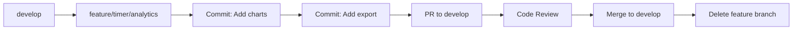

# 🌳 HabitFlow Branching Strategy

## Overview

This document outlines the branching strategy for the HabitFlow project. We use a modified Git Flow approach optimized for continuous development and deployment.

---

## 📊 Branch Structure

### **Permanent Branches**

#### 🟢 `main` - Production Branch
- **Purpose**: Stable, production-ready code
- **Deploy Target**: Production environment
- **Protection**: ✅ Protected, requires PR reviews
- **Merge From**: `staging` only
- **Version Tags**: All releases tagged here (v1.0.0, v1.1.0, etc.)

#### 🔵 `develop` - Integration Branch  
- **Purpose**: Latest development code, integration point
- **Deploy Target**: Development environment (optional)
- **Protection**: ✅ Requires CI checks to pass
- **Merge From**: Feature branches, bugfix branches
- **Merge To**: `staging` when ready for release

#### 🟡 `staging` - Pre-Production Branch
- **Purpose**: Pre-production testing, QA
- **Deploy Target**: Staging environment
- **Protection**: ⚠️ Optional protection
- **Merge From**: `develop` only
- **Merge To**: `main` after testing passes

---

### **Temporary Branches**

These branches are created for specific purposes and deleted after merging.

#### 🎯 Feature Branches
```
feature/<area>/<description>
```

**Examples:**
- `feature/timer/session-tags`
- `feature/tasks/bulk-actions`
- `feature/habits/streak-tracking`
- `feature/ui/dark-mode-enhancements`

**Workflow:**
```bash
git checkout develop
git checkout -b feature/timer/session-tags
# Work on feature...
git push origin feature/timer/session-tags
# Create PR to develop
# After merge, delete branch
```

#### 🐛 Bugfix Branches
```
bugfix/<description>
```

**Examples:**
- `bugfix/timer-persistence-issue`
- `bugfix/task-save-error`
- `bugfix/auth-session-timeout`

**Workflow:**
```bash
git checkout develop
git checkout -b bugfix/timer-persistence-issue
# Fix bug...
git push origin bugfix/timer-persistence-issue
# Create PR to develop
```

#### 🚨 Hotfix Branches
```
hotfix/<critical-issue>
```

**Purpose**: Critical production bugs that need immediate fix

**Examples:**
- `hotfix/login-crash`
- `hotfix/data-loss-bug`
- `hotfix/security-vulnerability`

**Workflow:**
```bash
# Branch from main (production)
git checkout main
git checkout -b hotfix/login-crash

# Fix the critical issue
git commit -m "hotfix: fix login crash on mobile"

# Merge to main first
git checkout main
git merge hotfix/login-crash
git push origin main

# Also merge to develop to keep in sync
git checkout develop
git merge hotfix/login-crash
git push origin develop

# Delete hotfix branch
git branch -d hotfix/login-crash
```

#### 🔧 Refactor Branches
```
refactor/<area>
```

**Examples:**
- `refactor/ui/component-structure`
- `refactor/timer/state-management`
- `refactor/api/error-handling`

#### 🧪 Test Branches
```
test/<test-area>
```

**Examples:**
- `test/e2e/timer-workflows`
- `test/unit/task-store`
- `test/integration/auth-flow`

#### 📚 Documentation Branches
```
docs/<topic>
```

**Examples:**
- `docs/api/endpoints`
- `docs/setup/installation`
- `docs/architecture/diagrams`

#### 🔨 Chore Branches
```
chore/<task>
```

**Examples:**
- `chore/deps/update-react`
- `chore/config/eslint-rules`
- `chore/cleanup/remove-unused-files`

---

## 🎯 Branch Naming Convention

### Format:
```
<type>/<area>/<short-description>
```

### Type Prefixes:
- `feature/` - New functionality
- `bugfix/` - Bug fixes  
- `hotfix/` - Critical production fixes
- `refactor/` - Code improvements (no behavior changes)
- `test/` - Adding/updating tests
- `docs/` - Documentation only
- `chore/` - Dependencies, configs, maintenance

### Area Identifiers:
- `timer/` - Timer system features
- `tasks/` - Task management
- `habits/` - Habit tracking
- `auth/` - Authentication & security
- `ui/` - UI/UX components
- `infra/` - Infrastructure/tooling
- `api/` - API endpoints
- `db/` - Database related

### Guidelines:
- ✅ Use lowercase with hyphens
- ✅ Keep descriptions short but clear
- ✅ Use present tense verbs
- ❌ No spaces or special characters
- ❌ Avoid generic names like "fix" or "update"

**Good Examples:**
```
feature/timer/ai-insights
bugfix/tasks/template-save-error
hotfix/auth/session-expiry
refactor/ui/button-components
test/e2e/timer-persistence
docs/api/authentication
chore/deps/update-typescript-5
```

**Bad Examples:**
```
❌ fix
❌ update-stuff
❌ new feature
❌ feature/my_work
❌ timer-fix-123
```

---

## 🔄 Development Workflow

### Standard Feature Development



### Release Workflow

```
1. develop (ready for release)
   ↓
2. Merge develop → staging
   ↓
3. Deploy to staging environment
   ↓
4. Run E2E tests, QA testing
   ↓
5. If tests pass:
   ↓
6. Merge staging → main
   ↓
7. Tag release (v1.x.x)
   ↓
8. Deploy to production
```

### Hotfix Workflow

```
1. Critical bug found in production
   ↓
2. Create hotfix branch from main
   ↓
3. Fix bug, test locally
   ↓
4. Merge to main (immediate deploy)
   ↓
5. Merge to develop (keep in sync)
   ↓
6. Delete hotfix branch
```

---

## 📋 Step-by-Step Workflows

### Creating a New Feature

```bash
# 1. Make sure develop is up to date
git checkout develop
git pull origin develop

# 2. Create feature branch
git checkout -b feature/timer/session-notes

# 3. Make changes and commit
git add .
git commit -m "feat(timer): add session notes functionality"

# 4. Push branch to remote
git push -u origin feature/timer/session-notes

# 5. Create Pull Request on GitHub
# Go to: https://github.com/Gravirei/HabitFlow/compare/develop...feature/timer/session-notes

# 6. After PR is approved and merged
git checkout develop
git pull origin develop
git branch -d feature/timer/session-notes  # Delete local branch
```

### Keeping Feature Branch Updated

```bash
# While working on a long-running feature
git checkout feature/timer/analytics

# Pull latest changes from develop
git checkout develop
git pull origin develop

# Merge develop into your feature
git checkout feature/timer/analytics
git merge develop

# Or use rebase for cleaner history
git rebase develop

# Resolve any conflicts, then
git push origin feature/timer/analytics
```

### Releasing to Production

```bash
# 1. Merge develop to staging
git checkout staging
git pull origin staging
git merge develop
git push origin staging

# 2. Deploy to staging environment and test
# Run E2E tests: npm run test:e2e
# Manual QA testing

# 3. If all tests pass, merge to main
git checkout main
git pull origin main
git merge staging

# 4. Tag the release
git tag -a v1.1.0 -m "Release v1.1.0: Add timer analytics and session notes"
git push origin main --tags

# 5. Deploy to production
```

### Emergency Hotfix

```bash
# 1. Create hotfix from main
git checkout main
git pull origin main
git checkout -b hotfix/timer-crash

# 2. Fix the bug
# Edit files...
git add .
git commit -m "hotfix: fix timer crash on mobile devices"

# 3. Merge to main immediately
git checkout main
git merge hotfix/timer-crash
git tag -a v1.1.1 -m "Hotfix v1.1.1: Fix timer crash"
git push origin main --tags

# 4. Merge to develop to keep in sync
git checkout develop
git merge hotfix/timer-crash
git push origin develop

# 5. Merge to staging
git checkout staging
git merge hotfix/timer-crash
git push origin staging

# 6. Clean up
git branch -d hotfix/timer-crash
```

---

## 🛡️ Branch Protection Rules

### `main` Branch Protection

**Required Settings (GitHub → Settings → Branches → Add Rule):**

```
✅ Require pull request reviews before merging
   └─ Required approving reviews: 1
   └─ Dismiss stale pull request approvals when new commits are pushed

✅ Require status checks to pass before merging
   └─ Require branches to be up to date before merging
   └─ Status checks: CI/CD pipeline, Tests

✅ Require conversation resolution before merging

✅ Require linear history (no merge commits)

✅ Include administrators (apply rules to admins too)

❌ Allow force pushes (DISABLED)
❌ Allow deletions (DISABLED)
```

### `develop` Branch Protection

```
✅ Require status checks to pass before merging
   └─ Status checks: CI/CD pipeline, Tests

✅ Require conversation resolution before merging

⚠️  Require pull request reviews (optional for solo dev)

✅ Allow force pushes (for rebasing)
```

### `staging` Branch Protection

```
✅ Require status checks to pass before merging
   └─ Status checks: CI/CD pipeline, Tests

⚠️  Optional: Can be less strict than main/develop
```

---

## 🏷️ Commit Message Convention

We follow the Conventional Commits specification for clear, semantic commit messages.

### Format:
```
<type>(<scope>): <subject>

<optional body>

<optional footer>
```

### Types:
- `feat`: New feature
- `fix`: Bug fix
- `docs`: Documentation only
- `style`: Formatting, missing semicolons, etc.
- `refactor`: Code change that neither fixes a bug nor adds a feature
- `perf`: Performance improvement
- `test`: Adding or updating tests
- `chore`: Maintenance, dependencies, configs
- `ci`: CI/CD changes
- `build`: Build system changes

### Scopes (based on HabitFlow areas):
- `timer`: Timer system
- `tasks`: Task management
- `habits`: Habit tracking
- `auth`: Authentication
- `ui`: UI components
- `api`: API endpoints
- `db`: Database
- `infra`: Infrastructure

### Examples:

```bash
# Feature
git commit -m "feat(timer): add session tagging functionality"

# Bug fix
git commit -m "fix(tasks): resolve template save error on mobile"

# Hotfix
git commit -m "hotfix(auth): fix critical session timeout issue"

# Refactor
git commit -m "refactor(ui): restructure button component hierarchy"

# Documentation
git commit -m "docs(readme): update installation instructions"

# With body
git commit -m "feat(timer): add analytics dashboard

- Add chart components for session visualization
- Implement data aggregation service
- Add export to CSV functionality"

# Breaking change
git commit -m "feat(api): migrate to new authentication system

BREAKING CHANGE: Old session tokens are no longer valid.
Users will need to re-authenticate after this update."
```

---

## 📊 Version Tagging

### Semantic Versioning (SemVer)

We use Semantic Versioning: `MAJOR.MINOR.PATCH`

```
v1.2.3
│ │ │
│ │ └─ PATCH: Bug fixes, hotfixes
│ └─── MINOR: New features, backwards-compatible
└───── MAJOR: Breaking changes, major releases
```

### When to Increment:

**MAJOR (v2.0.0):**
- Breaking API changes
- Major UI/UX overhaul
- Architecture changes
- Incompatible with previous versions

**MINOR (v1.3.0):**
- New features added
- New functionality
- Backwards-compatible changes

**PATCH (v1.2.4):**
- Bug fixes
- Hotfixes
- Minor improvements
- No new features

### Tagging Releases:

```bash
# Minor release (new features)
git tag -a v1.3.0 -m "Release v1.3.0: Add timer analytics and AI insights"
git push origin v1.3.0

# Patch release (bug fixes)
git tag -a v1.2.4 -m "Release v1.2.4: Fix timer persistence bug"
git push origin v1.2.4

# View all tags
git tag -l
```

---

## 🎯 Best Practices

### Do's ✅

- ✅ Always branch from `develop` for new features
- ✅ Keep feature branches short-lived (< 1 week)
- ✅ Commit often with meaningful messages
- ✅ Pull latest `develop` before starting work
- ✅ Rebase or merge `develop` regularly into feature branches
- ✅ Write descriptive PR descriptions
- ✅ Delete branches after merging
- ✅ Tag all releases in `main`
- ✅ Run tests before creating PR
- ✅ Keep commits atomic (one logical change per commit)

### Don'ts ❌

- ❌ Never commit directly to `main`
- ❌ Don't push broken code to `develop`
- ❌ Avoid long-running feature branches (merge often)
- ❌ Don't mix multiple features in one branch
- ❌ Never force push to `main`, `develop`, or `staging`
- ❌ Don't merge without code review (for main)
- ❌ Avoid generic commit messages ("fix", "update")
- ❌ Don't leave unmerged branches for weeks
- ❌ Never skip testing before deploying to production
- ❌ Don't create branches from wrong base branch

---

## 🚀 Quick Reference

### Common Commands

```bash
# Check current branch
git branch

# Create new feature branch
git checkout -b feature/timer/new-feature

# Switch branches
git checkout develop

# Update current branch with latest
git pull origin develop

# Merge develop into your feature branch
git merge develop

# Delete local branch
git branch -d feature/timer/old-feature

# Delete remote branch
git push origin --delete feature/timer/old-feature

# View all branches (local and remote)
git branch -a

# See recent commits
git log --oneline -10

# See branch graph
git log --oneline --graph --all
```

### Branch Status Check

```bash
# Check if branch is up to date
git fetch origin
git status

# See differences between branches
git diff develop..feature/timer/analytics

# See commits in feature not in develop
git log develop..feature/timer/analytics
```

---

## 📞 Questions?

If you have questions about the branching strategy:

1. Check this document first
2. Review the [Git Flow](https://nvie.com/posts/a-successful-git-branching-model/) model
3. Ask in team discussions

---

## 📅 Document History

- **v1.0.0** (2026-01-30): Initial branching strategy established
  - Created `main`, `develop`, `staging` branches
  - Defined branch naming conventions
  - Established protection rules

---

**Last Updated:** 2026-01-30  
**Maintained By:** HabitFlow Development Team
